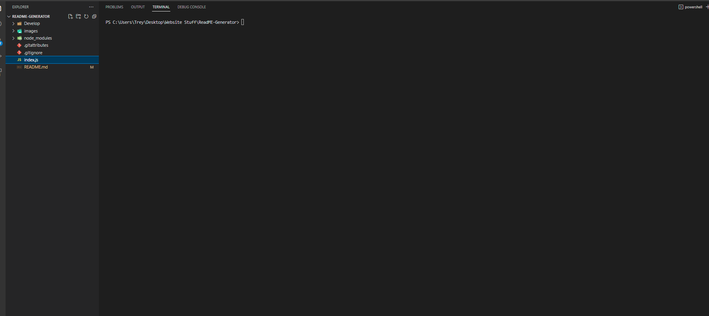
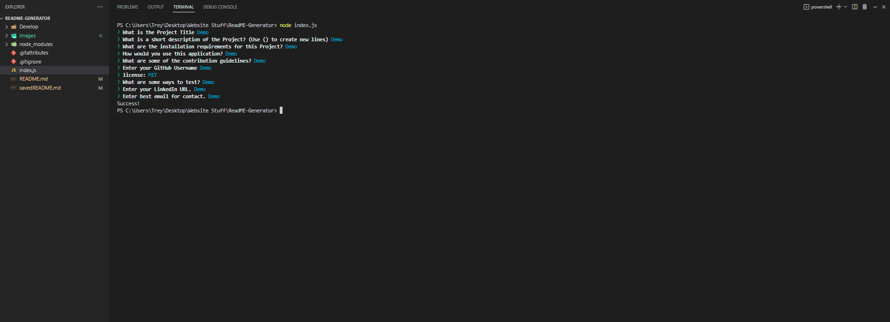

# ReadME Generator

## Description

Using 'fs' and 'inquirer' we used a prompt system to be able to take input from the terminal. 
Each question comes to the terminal once answer a README will be made.

## Table of Contents 

- [Installation](#installation)
- [Usage](#usage)
- [License](#license)
- [Questions](#Questions)

## Installation

Inquirer, NPM, and all the node modules.

## Usage

You would this in the Integrated Terminal and put in user input to the questions to generate a professional readme.

Here is a video on how to generate your README.md file: https://drive.google.com/file/d/1Fr7R9tOpklfXSSMIsfvXKAysTC4rSz-1/view

## License

This is under the  license.

---

## Questions

If you would like to contact me for any questions or possible freelance work reach out to me to my links:
- https://github.com/TreyMBach
- https://www.linkedin.com/in/trey-bach-191183200/
- treybachyt@gmail.com

 
